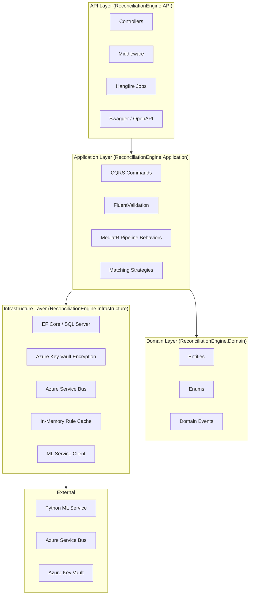
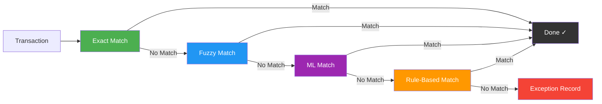

# Financial Reconciliation Engine

<p align="center">
  
  
  
  
  
</p>

<p align="center">
  A .NET 8 backend for financial transaction reconciliation — ingest transactions from multiple sources, run a configurable matching pipeline, and surface exceptions for manual review.
</p>

---

## Architecture



## Project Structure

```
ReconciliationEngine/
├── ReconciliationEngine.sln
├── README.md
├── .gitignore
│
├── ReconciliationEngine.Domain/                   # Core business logic & entities
│   ├── Common/
│   │   └── Entity.cs                              # Base entity (Id, CreatedAt UTC)
│   ├── Entities/
│   │   ├── Transaction.cs                          # Financial transaction
│   │   ├── ReconciliationRecord.cs                 # Matched transaction pair record
│   │   ├── ExceptionRecord.cs                      # Unmatched / exception transaction
│   │   ├── AuditLog.cs                             # Append-only audit trail
│   │   └── MatchingRule.cs                         # Configurable matching rule
│   ├── Enums/
│   │   ├── TransactionStatus.cs                    # Pending, Matched, Exception
│   │   ├── ExceptionCategory.cs                    # Mismatch, Duplicate, Unmatched
│   │   ├── ExceptionStatus.cs                      # PendingReview → Resolved/Dismissed
│   │   └── MatchMethod.cs                          # Exact, Fuzzy, RuleBased, ML
│   └── Events/
│       ├── DomainEvent.cs                          # Base domain event
│       ├── TransactionIngestedEvent.cs
│       ├── TransactionMatchedEvent.cs
│       └── ExceptionRaisedEvent.cs
│
├── ReconciliationEngine.Application/               # Use cases & orchestration
│   ├── Commands/
│   │   ├── IngestTransactionCommand.cs             # CQRS: ingest a transaction
│   │   ├── IngestTransactionCommandHandler.cs
│   │   ├── MatchingPipelineCommand.cs              # CQRS: run matching pipeline
│   │   └── MatchingPipelineCommandHandler.cs
│   ├── Interfaces/
│   │   ├── ITransactionRepository.cs
│   │   ├── IAuditLogger.cs
│   │   ├── IEventPublisher.cs
│   │   ├── IEncryptionService.cs
│   │   ├── IMatchingRuleCache.cs
│   │   └── IMLServiceClient.cs
│   ├── Services/Matching/
│   │   ├── IMatchingStrategy.cs                    # Strategy pattern interface
│   │   ├── ExactMatchingStrategy.cs                # Amount + Currency + Date + Ref
│   │   ├── FuzzyMatchingStrategy.cs                # FuzzySharp ≥ 0.92 similarity
│   │   ├── RuleBasedMatchingStrategy.cs            # Configurable rules from DB
│   │   └── MLMatchingStrategy.cs                   # External ML service scoring
│   ├── Validators/
│   │   └── IngestTransactionCommandValidator.cs    # FluentValidation rules
│   └── Data/
│       └── ReconciliationDbContext.cs              # EF Core DbContext
│
├── ReconciliationEngine.Infrastructure/            # External concerns
│   ├── Data/Configurations/                        # EF Core entity configurations
│   ├── Persistence/
│   │   ├── TransactionRepository.cs
│   │   └── AuditLogger.cs
│   ├── Services/
│   │   ├── AzureKeyVaultEncryptionService.cs       # AES-256 via Key Vault key
│   │   └── MLServiceClient.cs                      # HTTP client for ML scoring
│   ├── Events/
│   │   └── AzureServiceBusEventPublisher.cs        # Domain events → ASB topic
│   └── Cache/
│       └── MatchingRuleCache.cs                    # Thread-safe in-memory cache
│
├── ReconciliationEngine.API/                       # HTTP entry point
│   ├── Controllers/
│   │   └── TransactionsController.cs
│   ├── Middleware/
│   │   ├── CorrelationIdMiddleware.cs              # X-Correlation-Id propagation
│   │   └── GlobalExceptionMiddleware.cs            # RFC 9110 Problem Details
│   ├── Behaviors/
│   │   └── ValidationBehavior.cs                   # MediatR pipeline + FluentValidation
│   ├── Jobs/
│   │   ├── DeadLetterMonitorJob.cs                 # Every 5min — ASB dead-letter
│   │   ├── StaleExceptionAlertJob.cs               # Daily 08:00 — unassigned >48h
│   │   └── RuleCacheRefreshJob.cs                  # Every 10min — refresh rules
│   ├── Configuration/
│   │   └── JwtConfiguration.cs
│   └── Program.cs
│
├── ReconciliationEngine.Tests/                     # 78 tests (xUnit + FluentAssertions)
│   ├── Domain/
│   ├── Validation/
│   ├── Integration/
│   ├── Matching/
│   └── E2E/
│
└── recon-ml/                                       # Python ML scoring service
    ├── models/
    └── reports/
```

## Key Capabilities

### Transaction Ingestion
- **Idempotent**: Unique constraint on `(Source, ExternalId)` — duplicate submissions return `200` with the existing record
- **Encrypted at rest**: `AccountId` and `Description` encrypted with AES-256 via Azure Key Vault
- **Audited**: Append-only `AuditLog` with correlation ID tracing across the entire flow
- **Validated**: FluentValidation pipeline — 35 supported currencies, positive amounts, max lengths

### Matching Pipeline



The pipeline runs in priority order and **short-circuits** on the first match:

| Strategy | Method | When It Matches |
|----------|--------|-----------------|
| **Exact** | Amount + Currency + Date + Reference (trimmed, case-insensitive) | All four fields match exactly |
| **Fuzzy** | FuzzySharp weighted ratio ≥ 0.92, date within ±1 day | Reference/description similar enough |
| **ML** | External Python service scores candidate pairs ≥ 0.85 confidence | Complex pattern recognition |
| **Rule-Based** | Configurable rules from DB (amount tolerance, reference prefix, date range) | Evaluated in priority order |

When no strategy finds a match, the transaction is marked as an **Exception** (`ExceptionCategory.Unmatched`) for manual review.

### Security
- **JWT Bearer authentication** with RBAC (Operator, Admin roles)
- **Hangfire Dashboard** restricted to Admin role only
- **PII masking** in Serilog structured logs
- **Append-only AuditLog** — no update/delete paths exist

### Background Jobs (Hangfire)

| Job | Schedule | Purpose |
|-----|----------|---------|
| `DeadLetterMonitorJob` | Every 5 min | Monitors ASB dead-letter queue for failed event delivery |
| `StaleExceptionAlertJob` | Daily 08:00 UTC | Alerts on exceptions >48h without an assigned reviewer |
| `RuleCacheRefreshJob` | Every 10 min | Refreshes in-memory matching rules from database |

## Quick Start

```bash
# Requirements
# - .NET 8 SDK
# - SQL Server instance (local, Docker, or remote)
# - Azure Service Bus namespace (for event publishing)
# - Azure Key Vault (for encryption keys)

# Clone and build
git clone <repo-url>
cd ReconciliationEngine
dotnet build ReconciliationEngine.sln

# Configure connection strings
cp ReconciliationEngine.API/appsettings.json ReconciliationEngine.API/appsettings.Development.json
# Edit appsettings.Development.json with your:
#   - ConnectionStrings:DefaultConnection
#   - Jwt:Authority / Jwt:Audience
#   - KeyVault:Url / KeyVault:KeyName
#   - ServiceBus:ConnectionString

# Apply EF Core migrations (creates schema)
dotnet ef database update --project ReconciliationEngine.API \
  -- --connection "Server=localhost;Database=ReconciliationEngine;Trusted_Connection=True;TrustServerCertificate=True"

# Run the API
dotnet run --project ReconciliationEngine.API

# Run tests
dotnet test ReconciliationEngine.Tests
```

### Docker (SQL Server)

```bash
# Start a local SQL Server for development
docker run -e "ACCEPT_EULA=Y" -e "MSSQL_SA_PASSWORD=YourPassword123!" \
  -p 1433:1433 -d mcr.microsoft.com/mssql/server:2022-latest

# Update connection string in appsettings.Development.json
# Then run migrations and start the API as above
```

## API Endpoints

| Method | Path | Auth | Description |
|--------|------|------|-------------|
| `POST` | `/api/transactions` | Bearer (Operator) | Ingest a financial transaction |
| `GET` | `/api/transactions` | Bearer (Operator) | List transactions |
| `GET` | `/hangfire` | Bearer (Admin) | Hangfire job dashboard |
| `GET` | `/swagger` | — | Swagger UI (development only) |

### POST /api/transactions

```json
{
  "source": "BankFeedA",
  "externalId": "EXT-20240101-001",
  "amount": 1500.00,
  "currency": "USD",
  "transactionDate": "2024-01-01",
  "description": "Invoice payment",
  "reference": "INV-001",
  "accountId": "ACC-12345",
  "correlationId": "3fa85f64-5717-4562-b3fc-2c963f66afa6",
  "performedBy": "system"
}
```

**Responses:**
- `201 Created` — First ingestion, transaction stored as `Pending`
- `200 OK` — Duplicate `(Source, ExternalId)` pair, existing record returned
- `400 Bad Request` — Validation failure (invalid currency, negative amount, etc.)

## Tech Stack

<p align="left">
  
  
  
  
  
  
  
  
  
  
  
  
</p>

| Technology | Purpose |
|------------|---------|
| **.NET 8** | Target framework (C# 12, nullable enabled) |
| **EF Core 8.0** | ORM — SQL Server with code-first configurations |
| **MediatR 12.2** | CQRS command/query dispatch |
| **FluentValidation 11.x** | Request validation with MediatR pipeline behavior |
| **Hangfire 1.8** | Background job scheduling (recurring jobs) |
| **Azure Service Bus** | Domain event publishing (topics) |
| **Azure Key Vault** | Encryption key management (Managed Identity) |
| **Serilog** | Structured logging with PII masking |
| **xUnit + FluentAssertions + Moq** | Unit, integration, and E2E testing |
| **FuzzySharp 2.0** | Fuzzy string matching (Jaro-Winkler) |
| **Python / scikit-learn** | ML matching model (external service) |

## Configuration

Required `appsettings.json` values:

```json
{
  "ConnectionStrings": {
    "DefaultConnection": "Server=localhost;Database=ReconciliationEngine;..."
  },
  "Jwt": {
    "Authority": "https://your-auth-server.com",
    "Audience": "reconciliation-engine-api",
    "RequireHttpsMetadata": true
  },
  "KeyVault": {
    "Url": "https://your-keyvault.vault.azure.net/",
    "KeyName": "encryption-key"
  },
  "ServiceBus": {
    "ConnectionString": "Endpoint=sb://your-namespace.servicebus.windows.net/..."
  },
  "MLService": {
    "BaseUrl": "http://localhost:8000",
    "TimeoutSeconds": 5,
    "ConfidenceThreshold": 0.85
  }
}
```

## Testing

```bash
dotnet test ReconciliationEngine.Tests
# 78 tests passing
```

| Category | Tests | What's Covered |
|----------|-------|----------------|
| Domain & Validation | 38 | UTC timestamps, domain events, 35 currencies, field validation |
| Idempotent Ingestion | 11 | 201/200 responses, audit logs, event publishing, encryption |
| Matching Pipeline | 17 | Exact, Fuzzy, ML, Rule-Based, short-circuit behavior, ML strategy scoring |
| Infrastructure Security | 5 | AES-256 encryption, append-only audit log design |
| Middleware | 7 | Correlation ID, exception handling, Problem Details |

## License

MIT
