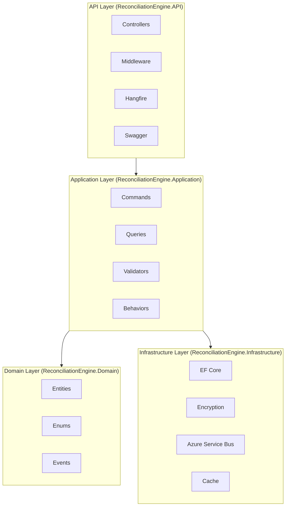
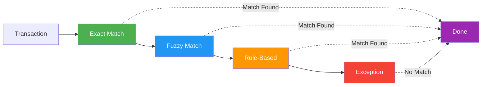

# Financial Reconciliation Engine

<p align="center">
  
  
  
</p>

<p align="center">
  A .NET 8 backend for a Financial Reconciliation Engine, built with Clean Architecture.
</p>

---

## Architecture



## Project Structure

```
ReconciliationEngine/
├── ReconciliationEngine.sln
├── README.md
├── .gitignore
│
├── ReconciliationEngine.Domain/           # Core business logic
│   ├── Common/
│   │   └── Entity.cs                      # Base entity with UTC timestamps
│   ├── Entities/
│   │   ├── Transaction.cs                  # Financial transaction
│   │   ├── ReconciliationRecord.cs         # Matched transaction pairs
│   │   ├── ExceptionRecord.cs              # Unmatched/exceptions
│   │   ├── AuditLog.cs                     # Append-only audit trail
│   │   └── MatchingRule.cs                 # Rule-based matching
│   ├── Enums/
│   │   ├── TransactionStatus.cs
│   │   ├── ExceptionCategory.cs
│   │   ├── ExceptionStatus.cs
│   │   └── MatchMethod.cs
│   └── Events/
│       ├── DomainEvent.cs
│       ├── TransactionIngestedEvent.cs
│       ├── TransactionMatchedEvent.cs
│       └── ExceptionRaisedEvent.cs
│
├── ReconciliationEngine.Application/       # Use cases & orchestration
│   ├── Commands/
│   │   ├── IngestTransactionCommand.cs     # Transaction ingestion
│   │   ├── IngestTransactionCommandHandler.cs
│   │   ├── MatchingPipelineCommand.cs      # Matching orchestration
│   │   └── MatchingPipelineCommandHandler.cs
│   ├── Interfaces/
│   │   ├── ITransactionRepository.cs
│   │   ├── IAuditLogger.cs
│   │   ├── IEventPublisher.cs
│   │   ├── IEncryptionService.cs
│   │   └── IMatchingRuleCache.cs
│   ├── Services/Matching/
│   │   ├── IMatchingStrategy.cs
│   │   ├── ExactMatchingStrategy.cs        # Exact match (Amount, Currency, Date, Ref)
│   │   ├── FuzzyMatchingStrategy.cs        # Jaro-Winkler similarity ≥0.92
│   │   └── RuleBasedMatchingStrategy.cs    # Configurable rules
│   ├── Validators/
│   │   └── IngestTransactionCommandValidator.cs
│   └── Data/
│       └── ReconciliationDbContext.cs
│
├── ReconciliationEngine.Infrastructure/    # External concerns
│   ├── Data/
│   │   └── Configurations/                # EF Core configurations
│   ├── Persistence/
│   │   ├── TransactionRepository.cs
│   │   └── AuditLogger.cs
│   ├── Services/
│   │   └── AzureKeyVaultEncryptionService.cs  # AES-256 + Key Vault
│   ├── Events/
│   │   └── AzureServiceBusEventPublisher.cs  # ASB topic publishing
│   └── Cache/
│       └── MatchingRuleCache.cs            # In-memory rule cache
│
├── ReconciliationEngine.API/                # HTTP layer
│   ├── Controllers/
│   │   └── TransactionsController.cs
│   ├── Middleware/
│   │   ├── CorrelationIdMiddleware.cs     # X-Correlation-Id header
│   │   ├── GlobalExceptionMiddleware.cs    # RFC 9110 Problem Details
│   │   └── ValidationExceptionMiddleware.cs
│   ├── Behaviors/
│   │   └── ValidationBehavior.cs           # MediatR pipeline
│   ├── Jobs/
│   │   ├── DeadLetterMonitorJob.cs        # Every 5 mins
│   │   ├── StaleExceptionAlertJob.cs      # Daily 08:00
│   │   └── RuleCacheRefreshJob.cs         # Every 10 mins
│   ├── Configuration/
│   │   └── JwtConfiguration.cs
│   └── Program.cs
│
└── ReconciliationEngine.Tests/              # Test suite (72 tests)
    ├── Domain/
    ├── Validation/
    ├── Integration/
    ├── Matching/
    └── E2E/
```

## Key Features

### Transaction Ingestion
- **Idempotent**: Unique constraint on `(Source, ExternalId)` - returns 200 if duplicate
- **Encrypted**: AccountId, Description encrypted with AES-256 via Azure Key Vault
- **Audited**: Append-only AuditLog with CorrelationId tracking

### Matching Pipeline



1. **Exact Match**: Amount, Currency, Date, Reference (trimmed, case-insensitive)
2. **Fuzzy Match**: Jaro-Winkler similarity ≥ 0.92, date within ±1 day
3. **Rule-Based**: Evaluated in Priority order from cache

### Security
- **JWT Bearer Authentication** with RBAC (Operator, Admin roles)
- **Hangfire Dashboard** protected - Admin role only
- **PII Masking** in Serilog logs (AccountId, Description, Notes)
- **Append-Only AuditLog** - no updates/deletes possible

### Background Jobs (Hangfire)

| Job | Schedule | Purpose |
|-----|----------|---------|
| DeadLetterMonitorJob | `*/5 * * * *` | Monitor ASB dead-letter queue |
| StaleExceptionAlertJob | `0 8 * * *` | Alert on exceptions >48h without reviewer |
| RuleCacheRefreshJob | `*/10 * * * *` | Refresh matching rules from DB |

## Configuration

Required `appsettings.json` values:

```json
{
  "ConnectionStrings": {
    "DefaultConnection": "Server=...;Database=ReconciliationEngine;..."
  },
  "Jwt": {
    "Authority": "https://your-auth-server.com",
    "Audience": "reconciliation-engine-api"
  },
  "KeyVault": {
    "Url": "https://your-keyvault.vault.azure.net/",
    "KeyName": "encryption-key"
  },
  "ServiceBus": {
    "ConnectionString": "Endpoint=sb://..."
  }
}
```

## Testing

```bash
dotnet test ReconciliationEngine.Tests
# 72 tests passing
```

### Test Coverage

| Category | Tests | Description |
|----------|-------|-------------|
| Domain & Validation | 38 | UTC timestamps, FluentValidation rules |
| Idempotent Ingestion | 11 | 201/200 responses, AuditLog, ASB events |
| Matching Pipeline | 11 | Exact, Fuzzy, Rule-Based, short-circuit |
| Infrastructure Security | 5 | AES-256 encryption, append-only AuditLog |
| Middleware | 7 | CorrelationId, Exception handling |

## Tech Stack

<p align="left">
  
  
  
  
  
  
  
  
  
  
</p>

- **.NET 8** - Target framework
- **EF Core 8.0** - SQL Server data access
- **MediatR 12.2** - CQRS pattern
- **FluentValidation 11.x** - Request validation
- **Azure Service Bus** - Event publishing
- **Azure Key Vault** - Key management (Managed Identity)
- **Hangfire 1.8** - Background job scheduling
- **Serilog** - Structured logging
- **xUnit + FluentAssertions** - Testing

## Getting Started

```bash
# Build
dotnet build ReconciliationEngine.sln

# Run migrations (SQL Server required)
dotnet ef database update --project ReconciliationEngine.API

# Run API
dotnet run --project ReconciliationEngine.API

# Run tests
dotnet test ReconciliationEngine.Tests
```

## API Endpoints

| Method | Endpoint | Auth | Description |
|--------|----------|------|-------------|
| POST | /api/transactions | Bearer | Ingest transaction |
| GET | /api/transactions | Bearer | List transactions |
| GET | /hangfire | Admin | Hangfire dashboard |

## License

MIT
