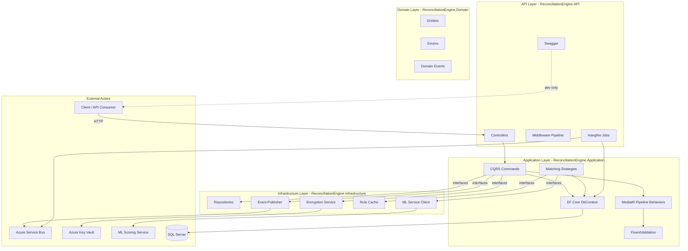
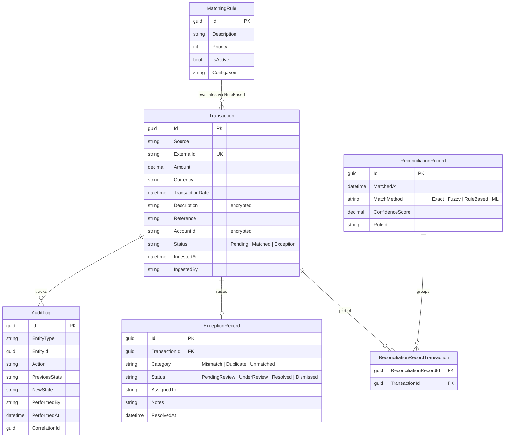
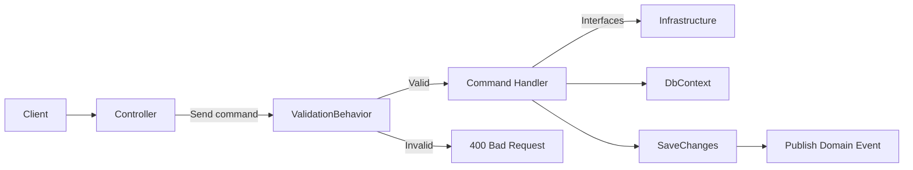
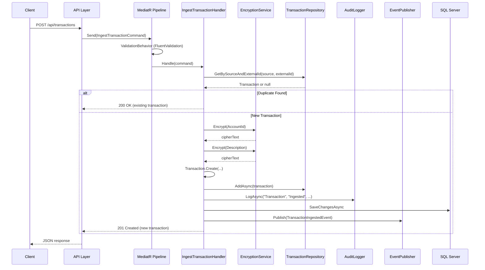

# System Design — Financial Reconciliation Engine

> **Last updated**: 2026-05-05
> **Target framework**: .NET 8.0
> **Database**: SQL Server

---

## 1. Goals & Key Capabilities

### Primary Goal
Automate the reconciliation of financial transactions ingested from disparate sources (bank feeds, payment gateways, internal systems) by running a cascading matching pipeline and surfacing unmatched transactions for manual review.

### Key Capabilities

| Capability | Description |
|------------|-------------|
| **Idempotent Ingestion** | Transactions keyed on `(Source, ExternalId)` — duplicate submissions return existing record without side effects |
| **Multi-Strategy Matching** | Four strategies in cascade: Exact → Fuzzy → ML → Rule-Based — first match wins |
| **Exception Management** | Unmatched transactions become exception records with assign/resolve/dismiss lifecycle |
| **Audit Trail** | Every mutation is appended to an immutable `AuditLog` with correlation ID traceability |
| **Event-Driven** | Domain events (ingested, matched, exception) published to Azure Service Bus for downstream consumers |
| **PII Protection** | Sensitive fields encrypted at rest using AES-256 via Azure Key Vault |
| **Background Jobs** | Hangfire-powered recurring jobs for dead-letter monitoring, stale exception alerts, and rule cache refresh |

### Non-Goals
- Real-time matching (pipeline is triggered on-demand per transaction)
- Multi-currency conversion (all matching is done in native currency)
- User-facing dashboard (API-only; dashboard is a separate consumer of the ASB events)
- High-availability clustering (single instance with Hangfire for background work)

---

## 2. Architecture Overview

The system follows **Clean Architecture** (ports & adapters) with **CQRS** as the command dispatch pattern. Dependencies point inward: the Domain layer has zero external dependencies.



### Layer Responsibilities

| Layer | Responsibility | External Dependencies |
|-------|---------------|-----------------------|
| **Domain** | Entities, enums, domain events — pure business logic | None |
| **Application** | Use cases (CQRS commands), matching strategies, validation, DbContext | MediatR, FluentValidation, EF Core |
| **Infrastructure** | Repository impl, encryption, event publishing, HTTP clients, caching | Azure SDK, EF Core SQL Server |
| **API** | HTTP entry point, middleware, job scheduling, DI composition | ASP.NET Core, Hangfire, Serilog |

---

## 3. Domain Model

### Entity Relationship Diagram



### Core Entities

| Entity | Identity | Key Behavior |
|--------|----------|--------------|
| **Transaction** | `Id` (guid) | `Create()`, `MarkAsMatched()`, `MarkAsException()` |
| **ReconciliationRecord** | `Id` (guid) | `Create(matchMethod, confidence, ruleId)`, `AddTransaction(id)` |
| **ReconciliationRecordTransaction** | Composite `(RecordId, TransactionId)` | Join table — pure value object |
| **ExceptionRecord** | `Id` (guid) | `AssignTo(user)`, `Resolve(notes)`, `Dismiss(notes)` |
| **AuditLog** | `Id` (guid) | `Create(...)` — no update/delete methods (append-only) |
| **MatchingRule** | `Id` (guid) | `Update(...)`, `Activate()`, `Deactivate()` |

### Enums

| Enum | Values | Usage |
|------|--------|-------|
| `TransactionStatus` | `Pending`, `Matched`, `Exception` | Transaction lifecycle |
| `MatchMethod` | `Exact`, `Fuzzy`, `RuleBased`, `ML` | How a match was found |
| `ExceptionCategory` | `Mismatch`, `Duplicate`, `Unmatched` | Why an exception was raised |
| `ExceptionStatus` | `PendingReview`, `UnderReview`, `Resolved`, `Dismissed` | Exception lifecycle |

### Domain Events

| Event | Raised When | Payload |
|-------|-------------|---------|
| `TransactionIngestedEvent` | New transaction persisted | `TransactionId`, `Source`, `CorrelationId` |
| `TransactionMatchedEvent` | Match found in pipeline | `ReconciliationRecordId`, `TransactionIds`, `MatchMethod`, `ConfidenceScore` |
| `ExceptionRaisedEvent` | No match found | `ExceptionRecordId`, `TransactionId`, `Category`, `CorrelationId` |

---

## 4. Key Architectural Patterns

### Clean Architecture (Ports & Adapters)

Dependencies flow inward. The **Domain** layer has zero external dependencies. The **Application** layer depends only on Domain and defines interfaces (ports) that Infrastructure implements (adapters).

```
┌─────────────────────────────────────┐
│        API Layer (HTTP)             │
│  Controllers, Middleware, Jobs      │
├─────────────────────────────────────┤
│     Application Layer (CQRS)        │
│  Commands, Strategies, Validation   │
│  Interfaces (ports)                 │
├─────────────────────────────────────┤
│   Infrastructure Layer (Adapters)   │
│  EF Core, Azure SDK, HTTP Clients   │
├─────────────────────────────────────┤
│       Domain Layer (Core)           │
│  Entities, Enums, Events            │
└─────────────────────────────────────┘
```

**Benefits:**
- Domain logic is testable without infrastructure (pure C#)
- Swapping SQL Server for PostgreSQL, or Azure Service Bus for RabbitMQ, requires only Infrastructure changes
- Framework decisions (EF Core, MediatR) don't leak into the domain

### CQRS with MediatR

Commands are plain C# records handled by dedicated handler classes. MediatR dispatches commands through a pipeline that includes validation.



**Current Commands:**
- `IngestTransactionCommand` → `IngestTransactionCommandHandler` — validates, encrypts PII, persists, audits, publishes
- `MatchingPipelineCommand` → `MatchingPipelineCommandHandler` — runs strategies, creates reconciliation record or exception, audits, publishes

### Strategy Pattern (Matching Pipeline)

Each matching strategy implements `IMatchingStrategy` and is tried in cascade. The pipeline short-circuits on the first non-null `MatchResult`.

```
Transaction → ExactMatch? → NO → FuzzyMatch? → NO → MLMatch? → NO → RuleBased? → NO → Exception
                │                      │                  │              │
                ↓ YES                  ↓ YES              ↓ YES          ↓ YES
              [Done]                 [Done]              [Done]         [Done]
```

### Event-Driven Integration

Domain events are published to an Azure Service Bus topic (`reconciliation.transactions`). Downstream consumers can subscribe to:
- `TransactionIngestedEvent` — trigger matching pipeline, update dashboards
- `TransactionMatchedEvent` — notify counterparties, update ledgers
- `ExceptionRaisedEvent` — trigger alerts, assign reviewers

### Append-Only Audit Log

Every state mutation writes an `AuditLog` entry. The log captures:
- **Who** performed the action (`PerformedBy`)
- **What** changed (`PreviousState` → `NewState` as JSON snapshots)
- **Why** they're related (`CorrelationId`)
- **When** it happened (`PerformedAt` UTC)

The `AuditLog` entity has **private setters** and **no Update/Modify methods** — it is append-only by design. Once written, an audit entry cannot be altered.

---

## 5. Data Flow — Transaction Ingestion & Matching

### Sequence: Ingestion



### Sequence: Matching

```mermaid
sequenceDiagram
    participant Client
    participant API as API Layer
    participant Handler as MatchingPipelineHandler
    participant Strategies as Strategy[Exact|Fuzzy|RuleBased|ML]
    participant Cache as RuleCache
    participant ML as ML Service
    participant Bus as EventPublisher
    participant DB as SQL Server

    Client->>API: POST /api/transactions/{id}/match
    API->>Handler: Send(MatchingPipelineCommand)
    Handler->>DB: Find transaction
    note over Handler: Check if already matched or exception

    loop Through Strategies [Exact, Fuzzy, RuleBased, ML]
        Handler->>Strategies: TryMatch(transaction, candidates)
        alt Strategy returns MatchResult
            Strategies-->>Handler: MatchResult
            Handler->>Handler: Mark transactions as Matched
            Handler->>DB: Add ReconciliationRecord + SaveChanges
            Handler->>Bus: Publish(TransactionMatchedEvent)
            Handler-->>API: IsMatched = true
            break
        else No match from this strategy
            Strategies-->>Handler: null
        end
    end

    note over Handler: No strategy matched
    Handler->>Handler: Create ExceptionRecord
    Handler->>DB: Add ExceptionRecord + SaveChanges
    Handler->>Bus: Publish(ExceptionRaisedEvent)
    Handler-->>API: IsMatched = false, ExceptionRecordId
```

---

## 6. Data Storage

### Database: SQL Server

- **EF Core 8.0** with code-first migrations
- 7 tables: `Transactions`, `ReconciliationRecords`, `ReconciliationRecordTransactions`, `ExceptionRecords`, `AuditLog`, `MatchingRules`
- Unique constraint on `Transactions(Source, ExternalId)` for idempotent ingestion
- Composite primary key on `ReconciliationRecordTransactions(RecordId, TransactionId)`

### Encryption at Rest

Sensitive fields (`AccountId`, `Description`) are encrypted at the application layer before storage:
- **Key management**: Azure Key Vault (key wrapped with `DefaultAzureCredential`)
- **Algorithm**: AES-256-CBC with PKCS7 padding
- **IV**: Random per encryption, prepended to ciphertext
- **Caching**: Derived key cached in memory with thread-safe refresh via `SemaphoreSlim`

### In-Memory Cache

`MatchingRuleCache` is an **in-memory, thread-safe** cache of active `MatchingRule` entities. Refreshed every 10 minutes by a Hangfire recurring job (`RuleCacheRefreshJob`). This avoids a DB round-trip on every matching pipeline execution.

---

## 7. Security

| Control | Implementation |
|---------|---------------|
| Authentication | JWT Bearer tokens, validated against configurable authority |
| Authorization | Role-based: `Operator` (standard access), `Admin` (Hangfire dashboard) |
| PII Encryption | AES-256 at application layer before EF Core persistence |
| Audit Trail | Immutable append-only audit log with correlation IDs |
| Log Sanitization | Serilog configuration avoids logging PII fields in plaintext |
| Exception Safety | Global exception middleware returns RFC 9110 Problem Details — no stack trace leaks |

---

## 8. Observability

| Concern | Tool |
|---------|------|
| Structured logging | Serilog with `Enrich.FromLogContext()`, correlation ID enrichment |
| Exception tracking | `GlobalExceptionMiddleware` captures all unhandled exceptions with structured context |
| Job monitoring | Hangfire dashboard at `/hangfire` (Admin role) |
| Dead-letter monitoring | `DeadLetterMonitorJob` every 5 minutes |
| Stale exception alerting | `StaleExceptionAlertJob` daily at 08:00 UTC |

---

## 9. Deployment Considerations

### Required Infrastructure
- SQL Server instance (connection string in config)
- Azure Service Bus namespace (topic: `reconciliation.transactions`)
- Azure Key Vault with an RSA/AES key
- (Optional) Python ML scoring service reachable via HTTP

### Configuration
All external dependencies are configured through `appsettings.json` / environment variables. The `MLService` section includes `TimeoutSeconds` to prevent the matching pipeline from hanging if the ML service is unavailable.

### Hangfire
- Uses SQL Server as the job store (same connection string)
- `WorkerCount` = `Environment.ProcessorCount`
- Concurrent execution disabled on job types via `[DisableConcurrentExecution]`

---

## 10. Test Strategy

| Layer | Test Type | Tools | Count |
|-------|-----------|-------|-------|
| Domain | Unit | xUnit + FluentAssertions | 9 |
| Validation | Unit | FluentValidation TestHelper | 16 |
| Matching | Unit | xUnit + Moq | 17 |
| Integration | Integration | InMemory EF Core + Moq | 16 |
| Middleware (E2E) | Integration | DefaultHttpContext | 7 |
| Infrastructure Security | Integration | InMemory EF Core + Moq | 5 |

**78 tests total.**

Key testing principles:
- Domain entities tested in isolation (no infrastructure)
- Matching strategies tested as pure functions
- Command handlers tested with in-memory database
- Mock external services (encryption, event publisher, ML client)
- Middleware tested with `DefaultHttpContext`
- Audit log append-only invariant verified via reflection
